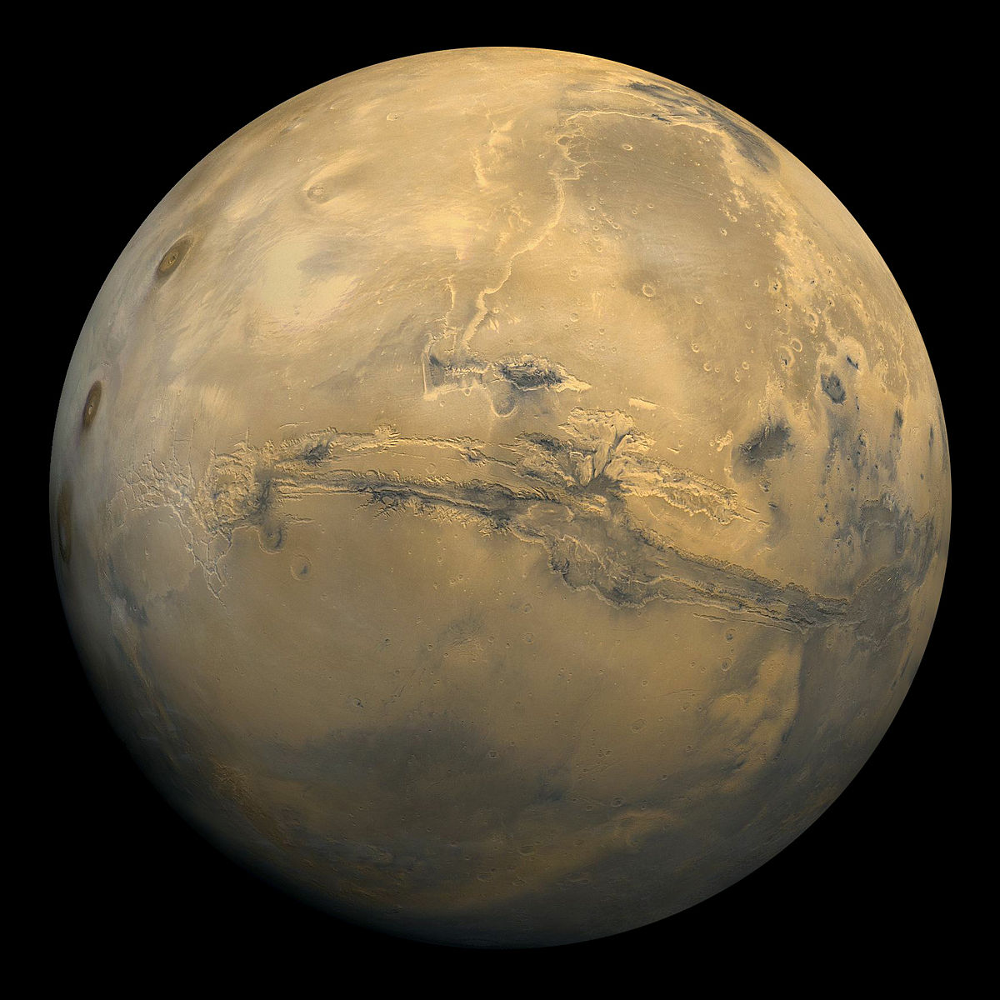

# BONJOUR A TOUS
La prochaine mission de la **NASA**

## Mais ce n'est past tout

Court terme | Long terme             
------------ | -------------
[Base lunaire](https://www.nasa.gov/content/humans-on-the-moon-0) | Base Martienne
Contrôle climat Terre |  Empêchement du réchauffement climatique
Amélioration de l'observation spatiale | Découverte d'une vie extra-terrestre

* Différentes missions de la Nasa : 

    * [Base lunaire]()
    * [Base martienne](https://www.nasa.gov/mission_pages/mars/main/index.html)
    * [Contrôle climat Terre](https://www.nasa.gov/topics/earth/index.html)
    * [Observation spatiale et au-délà](https://www.nasa.gov/topics/solarsystem/index.html)

